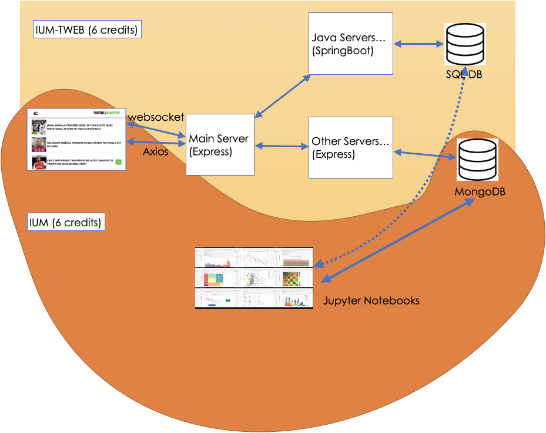

# Dipartimento di Informatica Università di Torino

## Assignment IUM-TWEB for 2024-2025

**26.11.2024**

# Self Assessment Form - IUM-TWEB

[Click here to access the Excel file for IUM](https://docs.google.com/spreadsheets/d/1pneO2CV1bf7wOouWsNZa1qNG0-fcnM3T5k2By4U2uVE/edit?usp=sharing)
[Click here to access the Excel file for TWEB](https://docs.google.com/spreadsheets/d/1h19ZbFX1oa2QQV7vcw3RVQO-ItVpohnOc0HGHbwyJto/edit?gid=1665968960#gid=1665968960)

### Introduction

This assignment is primarily concerned with applying the ideas that are being presented in the module on methods for accessing the Web and making sense of its content. In providing a solution, you are required to use the methods and techniques taught in the module.

You are given a set of data about films over the years.

The data is provided as a set of CSV files.

You are requested to create a system able to support access and analysis by fans and journalists (experts).

### Requirements

Here is the outline of the required architecture. Note that according to the module you are taking (IUM-TWEB 12 credits, IUM-TWEB 6 credits or IUM 6 credits) a different architecture is required.

The architecture is composed of a number of servers, some of them will be written in Javascript (Express), some of them in Java Spring Boot and some of them in Python (Flask). They interact with two types of databases: MongoDB and Postgres where the Transfermarkt data is to be stored.

**Functionalities**:

The goal of the work is to provide the possibility for fans and journalists to access data about films. You must design service with the following features:

- An HTML+Javascript+CSS+Handlebars page enables querying and exploring the data.
- The servers:
- IUM-TWEB (6 and 12 credits):
- Queries are sent to a central server implemented in Express which will communicate to other servers for database access, at least one written in Express and one in Java Spring Boot. The central server must be fast and be able to serve thousands of users, so it must not perform any heavy duties.
- The data will have to be divided into two subsets:
- the dynamic data with a reasonably fast change rate e.g. the reviews, the grossing, etc.
    - This should be stored in a MongoDB.
- the more static data such as the data about the actors and their films, the oscar winners, etc. This should be stored
- in a PostGres database (IUM-TWEB - 6 and 12 credits)
- a MongoDB or a SQL database of choice (IUM 6 credits)
- For IUM-TWEB (6 and 12 credits), the solution should also implement a chat system among fans and experts to discuss topics in specific topic based rooms (e.g. a film or an actor, etc.). This should be implemented using socket.io.
3. The Data Provided

You are provided with the following data files:

- [Main Data files](https://drive.google.com/drive/folders/1Kie8cRbJRiljUGrP6v3nNYikFHjZWbMg?usp=drive_link):
    - movies.csv: over 940,000 entries. columns: 'id' (film id - foreign key to the other relations) 'name' (title of film) 'date' (date of release) 'tagline' (the slogan on the poster) 'description' (a short story abstract) 'minute' (duration in minutes) 'rating'
    - countries.csv: over 693,000 entries: columns: 'id' (film id) 'country' (one of the originating countries - there may be more than one per film)
    - actors.csv; over 5.7 million entries. Columns: 'id' (film id) 'name' (name of actor) 'role' (character played)
    - crew.csv: over 4.7 million entries. Columns: 'id' (film id) 'role' (e.g. director) 'name' (name of person)
    - posters.csv: over 940,000 entries: columns 'id' (film id) 'link' (link to the original film posters)
    - releases.csv: over 13 million entries. Columns: 'id' (film id) 'country' (country of release) 'date' 'type' (Theatrical/Digital…) 'rating' (rating received in this country, e.g. PG, etc.)
- [Additional Data](https://drive.google.com/drive/folders/1pilJFEXVeNXT-wq098fY3WtOXB9BdwtN?usp=drive_link) (this is data from a different dataset, so it does not include the film id)
- The\_oscar\_awards.csv: over 10,000 entries about oscar candidates. Columns: 'year\_film' (the year the film was issued) 'year\_ceremony' (the year of the ceremony) 'category' (e.g. actor) 'name' (name of person) 'film' (the tile of the film) 'winner' (if they won or not)
- rotten\_tomatoes\_reviews.csv: over 1.1 million reviews from Rotten Tomato: columns: ['rotten\_tomatoes\_link' \*the url of the Rotten Tomatoes page (add ‘<https://www.rottentomatoes.com/>’ in front) 'movie\_title' 'critic\_name' 'top\_critic' 'publisher\_name' (where the review was published) 'review\_type' 'review\_score' 'review\_date' 'review\_content' ( the text of the actual review)
### Large Scale Data Analytics using Jupyter Notebooks

If you are taking IUM (6 credits) or IUM-TWEB (12 credits), you are requested also to develop one or more Jupyter Notebooks that enable analysis of data.

The Jupyter Notebook should enable the user to query the database in order to identify a subset of the data (e.g. stats about a specific film or a specific actor, etc.). It is required that you use a wide variety of visualisations (i.e. not just one type of graphs such as bar charts - it must include some geographical visualisations as well).

It is not required that the Jupyter notebook is connected to any of the servers (Flask, Express, etc.) in any way.

The Jupyter Notebooks must be provided in a runned format, i.e. showing all the graphs and tables, - we should not be required to run them during marking.

### Groups

The assignment is to be done in groups. Experience has demonstrated that it is not really possible for one person to do all the work for the assignment, unless they are an exceptionally competent programmer with previous knowledge of Web programming. Therefore, the assignment is organised on the basis that people should work in groups. Groups must be composed of

- a maximum of 3 members

Students are also allowed to do the assignment in pairs or on their own.

An important Remark

The assignment per se is open ended. You could spend a year building a fantastic website or producing data analytics and visualisations, inspecting several nuances of the data or the tasks.

That is definitely not the point of the assignment. The point of the assignment is to test if you master the technologies and methodologies introduced by the module. Therefore be sure to check the self assessment forms that tells you in detail what you will be evaluated upon.

Also if you are taking the 12 credit module, make sure to balance the effortç

- The IUM-TWEB is worth 6 credits - that is ⅔ of the efforts
- The IUM part is worth 3 credits - that is ⅓ of the effort

Make sure that your IUM part is worth half the IUM-TWEB part. In the past some students have mainly focussed on the IUM-TWEB part, largely underdeveloping the IUM part.

### Material Allowed - Plagiarism

You can freely use the lecture notes, lab classes examples and all materials used during the module. No third party code can be used in the assignment, except what has been explicitly provided in the lectures or lab classes. For example you are allowed to use some code given in the lecture slides but you are not allowed to download any code from the Web or to use any other software that will perform a considerable part of the assignment. Unauthorised re-use of third party software will be considered plagiarism. In case of doubt ask the lecturer for permission before using any third party code. Libraries allowed, despite not being mentioned in the lecture notes, are css/js/html libraries to improve the look and feel of any interface (e.g. Angular, Bootstrap, Vue, React). However note that the use of these libraries must be limited to the look and feel of the interface, i.e. as a replacement of HTML/CSS code. **You must not use any support for server implementation or communication with the Express or Spring Boot servers**. For example you cannot use any functions that would replace an Axios call.

For other libraries, please ask the lecturer before using them.

**The use of Generative AI tools is allowed, actually encouraged. However you are required to explain in your report how you used it. Also be sure to fully understand what you use because the oral examination will test your understanding**

### Marking schema

Each part of the assignment will carry marks divided as follows:

- 25% for the documentation in the project report.
- 50% for the implementation of your solution (quality of code and data analysis). See appendix A for further details on the specific marking schema.
- 25% for the correctness of results.
### Handing in

Your solution must be submitted **at least one week prior to the exam date** in a self-contained folder named after the group name (<MainDirectory> in the following).

The directory must contain:

1. The code of the solution (please note that we will both inspect and run the code).
    1. The interface and the communication with the server must be developed in HTML/CSS /Javascript. The server must be developed in Javascript and Java SpringBoot (IUM-TWEB - 6 and 12 credits) and/or Python (IUM - 6 credits - and IUM-TWEB 12 credits). We must be able to run your solution without problems on a standard computer. It should not need any applications or code or libraries to be installed in order to run. Use *npm* or *pip* or *Gradle* to make sure the system knows what libraries to load automatically.
    1. All the code should be in the directory **<MainDirectory>/solution**. Please note that the quality of the code carries a relevant portion of marks, so be sure to write it properly.
1. A report documenting your work. The report must be contained in the directory **<MainDirectory>/report/**. An outline and set of requirements for the report are provided in Appendix A.
1. The documentation within the code (Javascript/HTML/Java/Python) files must be of very high quality, both in terms of Javadoc (or equivalent) or in terms of Swagger documentation for the servers. Please note that this documentation carries a relevant portion of marks, so be sure to write it properly. For more information on guidelines for this type of documentation see http://www.oracle.com/technetwork/java/javase/documentation/index-1378 68.html
1. Some screenshots of at least 3 queries’ results must be stored in

   **<MainDirectory>/queryexamples**. These are used to check when we run your solution that the results are what you would expect.

5. The filled self assessment form. The self assessment forms are available at these links:
1. [IUM-TWEB](https://docs.google.com/spreadsheets/d/1XX3jQ3kQR0Wk12wOz1KtAEnWE9NttMSf/edit?usp=drive_link&ouid=104917255985453826971&rtpof=true&sd=true)
1. [IUM](https://docs.google.com/spreadsheets/d/1pmT2uY5RSZCOjN7_uWOOAC6gzXgXuKCr/edit?usp=drive_link&ouid=104917255985453826971&rtpof=true&sd=true)

The self assessment form must also be submitted within the github repo shared with the lecturer.

1. Division of work

It is required that every member of the group works on all parts of the solution. For example, it is required that

- All members work on both the IUM and the IUM-TWEB parts.
- All members work on both the Express and SpringBoot parts.
2. Private Github/Gitlab Repo

The solution must be provided via a link to a Gitlab or Github repository **at least one week prior to the exam date (i.e. if the exam starts on the 27th of September, the deadline is 23:59 of the 20th of September). Any solution submitted for whatever reason after the deadline will be rejected**. The repository must be used **regularly** during the development of the project by **all members** of the group. The repository will be used during the examination phase to:

- check that the project has actually been developed by the group
- provide clear indications of the contribution of each group member

For this reason, each group member will have to upload (commit) **personally** all the changes to the repository, ideally for each day of work on the project. That is, (i) the group must not delegate the task of making commits to a single member and (ii) commits must not be made only when the code (or a part of the code) is fully completed. We should see the intermediate work, ideally in separate branches.

**The name of the group members must be clearly identifiable with name and surname (e.g. Giovanna Rossi instead of xyzaa). Be very careful when you have more than one user e.g. in Github not to submit with multiple anonymous identities.**

You are allowed to use several github/gitlab repositories, each for a different part of the project, e.g. one repo for each of the servers, etc.

**Please note: if the group does not provide a satisfactory recording of the commits to demonstrate the actual progress of the project, the project will be rejected and the assignment redone from scratch.**

**The repositories must be shared** with

- **fabcira** on Github
- Ciravegna on the University Gitlab.

### Appendix A: Report Outline and Marking Schema

It is important that you produce a high quality report. Be sure not to leave the report at the very last minute. It is important that you do not ignore techniques and examples provided to you during the lectures and lab classes. Referring back to them during your planning/implementation stages will give you the base from where to start, as well as a point of comparison/discussion where your ideas differ from what already presented to you (i.e., do not reinvent the wheel – if it has been done before, reuse it and complement it where it lacks functionality). You may use diagrams to aid your explanation in these sections, but please note that a diagram alone is not acceptable and must be accompanied by an explanation/discussion.

Your report must be organised according to the following outline, which is designed to help you ensure that all the required information is provided.

Length: **maximum 5 pages for IUM-TWEB, 4 pages for IUM**. Any additional pages will be ignored.

**Index Table**

[No marks – OPTIONAL] - You may or may not want to include an index table on your report. This is completely up to you. This does not count against the page limit.

**Introduction**

[no marks] – This should give the marker a guide as to what to expect from your report. Please make the marker’s work easier by being honest.

**For each technical tasks:**

Create a subsection in your report for each of the technical requirements. It is very important that they are documented individually by explicitly following the organisation below.

- **Solution:**
- Design and its motivations: explain how your solution works and explain why you chose to design your solution in this particular way. Does it have advantages/disadvantages over other design choices?
- **Issues**
- Introduce the task this section refers to and the challenges that you were faced with.
- **Requirements**:
    - How does this design comply with the requirements specified in the original assignment sheet? Are you meeting all requirements?
- **Limitations**:
- Have you thought about exceptional situations that may limit your solution? Is your solution extensible? Can it be easily adapted for other requirements? Remember that no design is flawless and that is ok!

Moreover you should add:

- **Conclusions**
- [no marks] - You should include here any relevant conclusions you've collectively arrived at regarding the process of designing the solution for this part of the assignment as well as any lessons learned.
- **Division of Work**
- [No marks – MANDATORY] – Have all the group members shared the workload in a balanced way? In what way? E.g. what has each member provided – be precise!
- **Extra Information**
- [No marks – MANDATORY] – This section should include any extra details needed to run your code. If no extra configuration is needed, please explicitly say so in this section.
- **Bibliography**
- [no marks] - Do not forget to cite any sources and reference these within the text where appropriate (e.g., “(...) we have used the techniques as per [1].”).Make sure to use a standard format style. No need to cite the lecture notes or lab classes.
